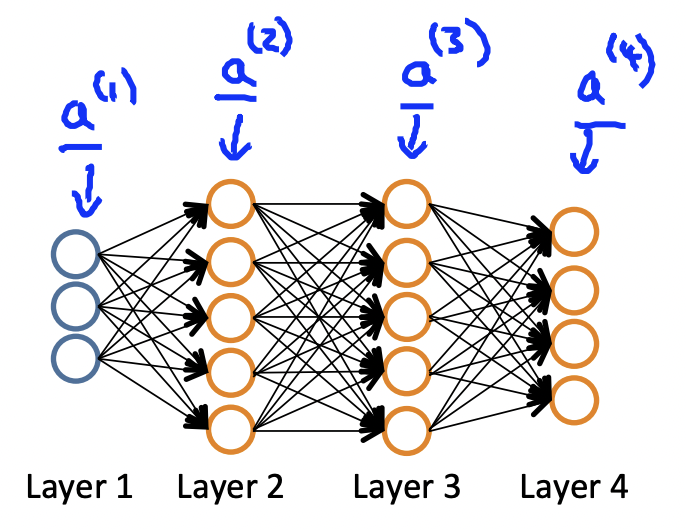

#### Cost Function

这里 $L$ 是神经网络的总层数, 注意到，我们看神经网络层数时不会把输入层考虑在内，$s_l$ 表示第$l$层神经元的个数,  $K$ 是输出单元的个数. 所以有：

$$J(\Theta)=-\frac{1}{m}[\sum_{i=1}^{m}\sum_{k=1}^{K}y^{(i)}_k 
\cdot log(h_{\Theta}(x^{(i)}))_k+(1-y^{(i)}_k)\cdot log(1-h_{\Theta}(x^{(i)})_k)]+\frac{\lambda}{m}\sum_{l=1}^{L-1}\sum_{i=1}^{s_{l}}\sum_{j=1}^{s_{l}+1}(\theta^{(l)}_{ij})^2$$
这里, $h_{\Theta}(x) \in R^{K}$.

#### Gradient computation

目标是 $min J(\Theta)$,  $\frac{\partial}{\partial \theta^{l}_{ij}}J(\Theta)$.

$$\begin{matrix} a^{(1)}=x \\ 
z^{(2)}=\Theta^{(1)}a^{(1)} \\
a^{(2)}=g(z^{(2)}), & add & a_0^{(2)} \\ z^{(3)}=\Theta^{(2)}a^{(2)} \\
a^{(3)}=g(z^{(3)}), & add & a_0^{(3)} \\ z^{(4)}=\Theta^{(3)}a^{(3)} \\ a^{(4)}=g(z(4)) & add & a^{(4)}_0
\end{matrix}$$

#### Backpropagation algorithm

Intuition: $\delta^{(l)}_j$ 是第$l$层的第$j$ 个神经元的误差， 对于最后一层 (输出层), $\delta^{(l)}_j=a^{(l)}_j-y_j$, 对于隐藏层, $\delta^{(l)}=(\Theta^{(l)})^T \delta^{(l+1)} \cdot g'(z^{(l)})$

##### Backpropagation algorithm process

+ 对于数据集$(x^{(i)},y^{(i)})$, 对于每个 $(l,i,j)$,设 $\Delta^{(l)}_{ij}=0$
+ 对于每条数据, $a^{(1)}=x^{(i)}$, 对 l=2,...,L, 通过前向传播计算 $a^{(l)}$.
+ 使用 $y{(i)}$ 计算 $\delta^{(L)}=a^{(L)}-y^{(i)}$.
+ 计算 $\delta^{(L-1)}$, $\delta^{(L-2)}$,...,$\delta^{(2)}$.
+ $\Delta^{(l)}_{ij}=\Delta^{(l)}_{ij}+a^{(l)}_{j}\Delta^{(l+1)}_{i}$
+ $D^{(l)}_{ij} = \begin{cases} \frac{1}{m}\Delta^{(l)}_{ij}+\lambda\Theta^{(l)}_{ij} & j \neq0 \\ \frac{1}{m}\Delta^{(l)}_{ij} & j = 0 \end{cases}$
and 
$\frac{\partial}{\partial \Theta^{(l)}_{ij}}J(\Theta)=D^{(l)}_{ij}$

