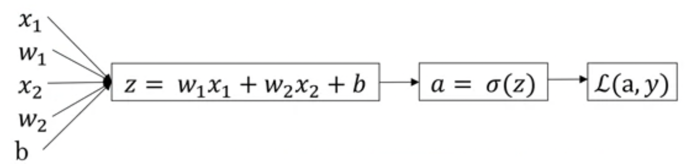

我们使用$(x^{(i)},y^{(i)})$ 表示数据集, 且有 $x_{(i)} \in R^n$, 对于二元分类 $y^{(i)} \in \{0,1\}$, 这里神经网络的输入为 $X=[x^{(1)},x^{(2)},...,x^{(m)}]$, 所以X 的shape为 $n \times m$, 输出 y 为 $1 \times m$.

#### Logistic Regression in Neural network

对于 $x \in R^n$, 希望有 $\hat{y} = P(y=1|x)$, 参数 $w \in R^n$, $b \in R$, 所以 $\hat{y}=g(w^T \cdot x + b )$, $g(z)=\frac{1}{1+e^{-z}}$. 在一些实现上, 参数w和参数b是在一起的，所以 x 会添加一个 $x_{(0)}$, 形状变为 $(n+1,1)$, w同理, 并且 $w^{(0)}$ 即为 b。我们没有这样做

##### Cost Function
损失函数: $L(\hat{y},y)=-ylog(\hat{y})-(1-y)log(1-\hat{y})$. (交叉熵损失函数)
代价函数: $J(w,b)=\frac{1}{m}\sum_{i=1}^{m}L(\hat{y},y)=-\frac{1}{m}\sum_{i=1}^{m}(y^{(i)}log(\hat{y}^{(i)})+(1-y^{(i)})log(1-\hat{y}^{(i)}))$ 

L1 Loss:
$$L1(\hat{y},y)=\sum_{i=1}^{m}|| y^{(i)} - \hat{y}^{(i)}||$$
注意到损失函数和代价函数的区别为，损失函数为单个训练数据的误差，代价函数是所有损失函数值的平均值。

##### Gradient Descent

代价函数为“非凸函数”. 我们会找到一个 $(w,b)$ 去最小化 $J(w,b)$.

更新规则: $$w=w-\alpha \frac{\partial J(w,b)}{\partial w}, b=b-\alpha \frac{\partial J(w,b)}{\partial b} \tag{1.1}$$.

计算图

对于上图，我们可以知道:

$$\begin{split} & da = -\frac{y}{a}+\frac{1-y}{1-a} \\ & dz = a-y \\ & dw_1=x_1(a-y) \\ &dw2=x_2(a-y) \\ & db = a-y \end{split}$$
update by (1.1)

