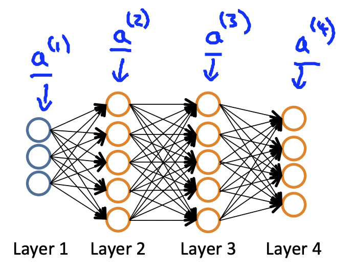

#### Cost Function

We assume $L$ as total layer numbers, and $s_l$ as units number of layer $l$, and $K$ as output units. So

$$J(\Theta)=-\frac{1}{m}[\sum_{i=1}^{m}\sum_{k=1}^{K}y^{(i)}_k 
\cdot log(h_{\Theta}(x^{(i)}))_k+(1-y^{(i)}_k)\cdot log(1-h_{\Theta}(x^{(i)})_k)]+\frac{\lambda}{m}\sum_{l=1}^{L-1}\sum_{i=1}^{s_{l}}\sum_{j=1}^{s_{l}+1}(\theta^{(l)}_{ij})^2$$
in there, $h_{\Theta}(x) \in R^{K}$.

#### Gradient computation

Our goal is $min J(\Theta)$, just as $\frac{\partial}{\partial \theta^{l}_{ij}}J(\Theta)$.

$$\begin{matrix} a^{(1)}=x^{(1)} \\ 
z^{(2)}=\Theta^{(1)}a^{(1)} \\
a^{(2)}=g(z^{(2)}), & add & a_0^{(2)} \\ z^{(3)}=\Theta^{(2)}a^{(2)} \\
a^{(3)}=g(z^{(3)}), & add & a_0^{(3)} \\ z^{(4)}=\Theta^{(3)}a^{(3)} \\ a^{(4)}=g(z(4)) & add & a^{(4)}_0
\end{matrix}$$

#### Backpropagation algorithm

Intuition: $\delta^{(l)}_j$ as error of unit $j$ in layer $l$. and for last layer (output layer), $\delta^{(l)}_j=a^{(l)}_j-y_j$, for hidden layer, $\delta^{(l)}=(\Theta^{(l)})^T \delta^{(l+1)} \cdot g'(z^{(l)})$

##### Backpropagation algorithm process

+ For dataset$(x^{(i)},y^{(i)})$, set $\Delta^{(l)}_{ij}=0$ for every $(l,i,j).$
+ for every single data, $a^{(1)}=x^{(i)}$, and for l=2,...,L, perform forward propagation to calculate $a^{(l)}$.
+ using $y{(i)}$ calculate $\delta^{(L)}=a^{(L)}-y^{(i)}$.
+ calculate $\delta^{(L-1)}$, $\delta^{(L-2)}$,...,$\delta^{(2)}$.
+ $\Delta^{(l)}_{ij}=\Delta^{(l)}_{ij}+a^{(l)}_{j}\Delta^{(l+1)}_{i}$
+ $D^{(l)}_{ij} = \begin{cases} \frac{1}{m}\Delta^{(l)}_{ij}+\lambda\Theta^{(l)}_{ij} & j \neq0 \\ \frac{1}{m}\Delta^{(l)}_{ij} & j = 0 \end{cases}$
and 
$\frac{\partial}{\partial \Theta^{(l)}_{ij}}J(\Theta)=D^{(l)}_{ij}$

